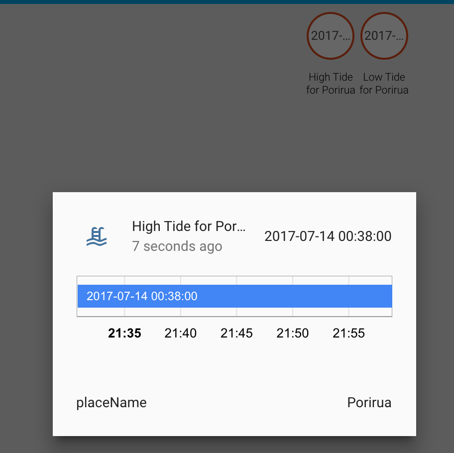

# Display the next high tide and/or low tide time using the Tidespy API

[](https://travis-ci.org/Br3nda/homeassistant-tidespy)



### Tidespy

[TideSpy](tidespy.com) is a New Zealand-based tide times provider based in Kaikoura, offering coverage of the USA, Caribbean Islands, most central and eastern Pacific Islands, Australia, and New Zealand. To use this component in your own Home Assistant instance, you should follow the instructions to sign up for a TideSpy account at http://tidespy.com/client/RawApi.php. 

**Before using this component, please read and respect TideSpy's requests in relation to how you use and display their data:**

> Important: If this data will be displayed to the public, a disclaimer and copyright notice must be displayed along with the information. Contact us for details.

#### API Key

To find your TideSpy API key, sign for an account from the API page, and return to the API page. Your API key is shown in bold in the second body paragraph.

#### Place ID

The Place ID is a 4-digit number representing a particular location to get tidal data for. The easiest way to find a place ID is to go to [Tidespy's alphabetical place index](http://tidespy.com/alphaPlaceIndex.php), and either filter by Country or Name. Once you have found a place, hover over any of the links next to the place name to preview the URL - the place ID is included.

For example, to find the place ID for Porirua, New Zealand, I select 'New Zealand' from the list of countries, and then browse through the list until I find 'Porirua'. Hovering over the globe icon shows the URL: "http://tidespy.com/index.php?place=3114", therefore the place ID is "3114".

### Example configuration

``` yaml
sensor:
  - platform: tidespy
    api_key: "YOUR TIDESPY API KEY"
    place_id: "YOUR TIDESPY PLACE ID"
```

You can have multiple sensors with different place IDs. Each sensor listed in configuration will have two sensors created - one with the high tide, one with the low tide (two sensors are created to make it easier to set up automations, etc based on the value of just a high or low tide.

The API key is duplicated because of how I could figure out to organise the code. If there is a way I can allow global configuration of an API key and even a default place ID, I would appreciate an issue report or pull request.

### Credit

Almost the entirety of this code is paraphrased from [Br3nda's Metlink sensor](https://github.com/Br3nda/metlink-wellington-homeassistant). I could not have written this sensor without this excellent reference example.

Of course, the ultimate credit goes to TideSpy, who has undertaken the heavy lifting of collecting, collating, and processing tidal data from a number of agencies to offer it via a web service to all.
